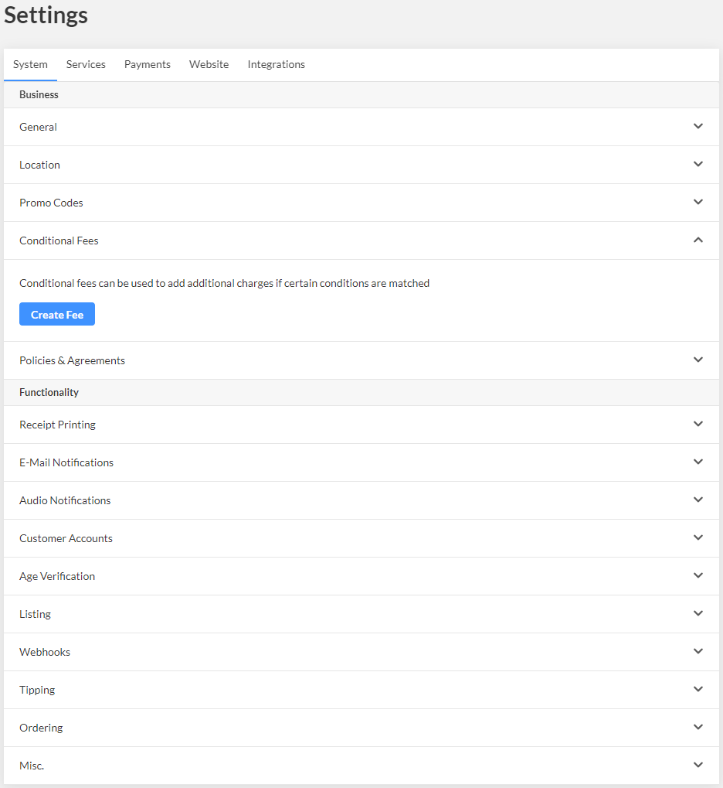

# Public Holiday Surcharge

Then, enter the details about your fee and select the days and times you'd like the fee to apply to.&#x20;

Then simply disable the fee to keep it saved and only turn it on when public holidays are coming up.

Don't forget to disable the fee again once the public holiday has passed.

<figure><figcaption></figcaption></figure>
